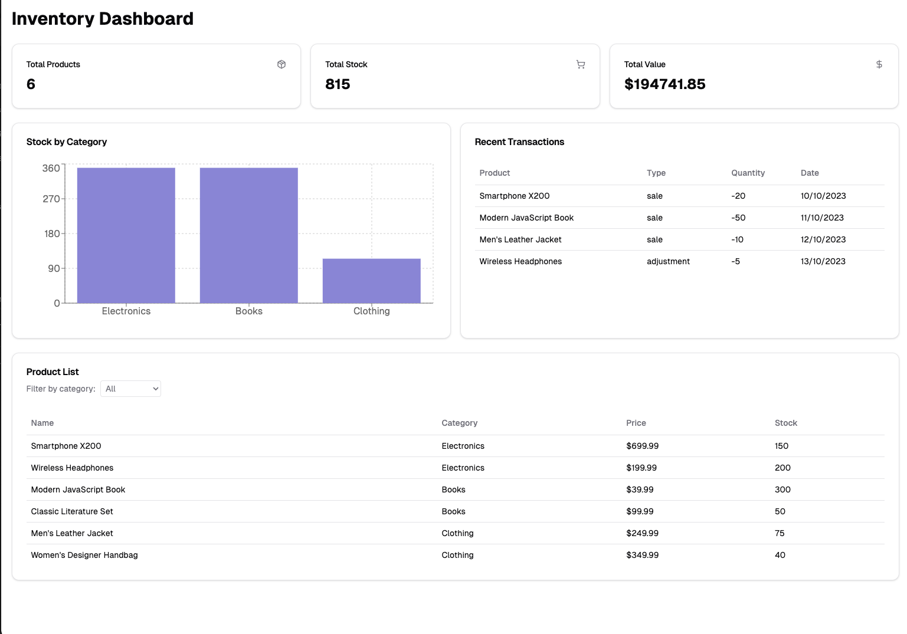

# Rototip Inventory Management Real World Case

##  Overview

You are tasked with building a web application for a retail store owner to manage their inventory. This real-world case study aims to assess your technical and analytical abilities, as well as your understanding of business requirements.

## Requirements

The application should have the following features:

- Inventory Visualization

  - Display charts and graphs to visualize inventory data.
  - You may use any charting library or framework of your choice.
  - Bonus: Animations, responsive design, and interactive features.

- Inventory Management

  - Allow the store owner to add new products and transactions.
  - Use any database or data storage solution you prefer (e.g., JSON server for mock data, PrismaORM with SQLite).
  - Bonus: Form validation and error handling.

### Technical Expectations

- Focus on demonstrating a solid understanding of the technologies you choose to use.
- You may use any framework or library, but we suggest Next.js with popular ORMs and UI libraries, as it aligns with our tech stack.
- Avoid spending time on implementing custom database or UI components if existing solutions are available.

### Additional Points

- User Experience

  - Bonus: Aesthetic UI, animations, responsive design, and overall user experience.
  - Bonus: Implement suspense and error handling.

- Business Understanding

  - Showcase your grasp of the business requirements and how they inform your technical solutions.
  - Feel free to implement additional features not listed here and present them during the interview.

### Timeline

- Duration: You have **2 weeks** to complete this case study. However you should not spend more than **6 hours** on it.
  If you finish earlier, please let us know to schedule a meeting.
  If you need more time, inform us to adjust expectations.
  Lack of communication during these 2 weeks will be considered a withdrawal from the application process.

### Submission and Presentation

- Perfection is not expected; we are more interested in your ideas and approach.
- Be prepared to walk us through your project and discuss your implementation during the interview.

Example of a basic UI:

_Any work done during this case study is for assessment purposes only and will not be used in Rototip's projects._
